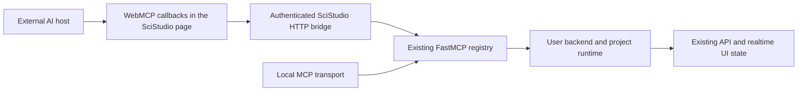

# ADR-055: WebMCP Bridge, External AI Hosts, And Local And Lab Deployment

## 1. Decision Summary

SciStudio will expose its existing MCP tool registry to browser agents through
the HTTP-to-WebMCP bridge demonstrated in `scistudio-web-demo`. The bridge
architecture is decided: the page discovers tools over HTTP, registers browser
callbacks, and forwards calls to the same backend FastMCP registry used by the
local MCP transport. Implementation work will harden and adapt that bridge.

Two deployments are supported: a scientist's own computer and an internal Linux
Lab server. Local users choose desktop use or external AI use at startup. Lab
users log in through JupyterHub, which routes them to their own SciStudio
backend managed through systemd. Each user has one backend, one bundled Python,
and one runtime environment shared by that user's projects. Docker and
per-project dependency isolation are not deployment requirements.

Project instructions, documentation, skills, and hook provisioning are existing
behavior. The addition in that area is one tool, `get_agent_context`, which
exposes the existing project context to an external agent. Workspace access and
file-transfer tools are a separate part of this ADR's scope.

The AI-host frontend will be designed in the implementation spec. The hackathon
layout, badges, tutorials, and other presentation changes are discarded. Browser
tool registration remains part of the selected transport architecture.

This is a Proposed architecture document. It records the owner's September 5,
2026 decisions for [issue #2239](https://github.com/jiazhenz026/SciStudio/issues/2239).
The issue's earlier public-demo deployment option is excluded by these decisions.
This draft does not mark the implementation issue complete.

### 1.1 Problems Addressed

| Problem | Risk | ADR response | Detailed section |
|---|---|---|---|
| Solo scientists use scientific tools through AI apps but SciStudio is outside that interaction | Users must manually bridge analysis, literature, and specialist tools | Make SciStudio available to the external agent through the selected WebMCP bridge | Section 4 |
| Lab data stays on Linux servers while scientists work through their own computers | Desktop and personal CLI-agent setup obstruct access | Provide identity, per-user native backend instances, and browser access | Section 8 |
| External agents do not automatically receive the existing project context | Agents miss instructions and cannot discover relevant project resources | Add `get_agent_context` over existing project assets | Section 5 |
| External agents need to operate on files that live beside the backend | Authoring and data exchange remain incomplete | Provide workspace, execution, and transfer tools | Section 5 |
| Desktop-oriented UX is cramped inside AI-app browsers | Core operations become difficult in a narrow viewport | Maintain an AI-host presentation with explicit host and capability handling | Section 6 |
| Local users cannot be expected to deploy or keep a full desktop window open | External AI mode is difficult to start and recover | Add a background runtime launch path and a copyable local address | Section 7 |
| Demo commits combine useful transport code with disposable deployment assumptions | A wholesale import introduces unrelated UX and runtime behavior | Selectively transplant bridge code after the recorded robustness checks | Section 9 |

## 2. Users And Deployment Boundary

A solo scientist works on their own data on their own computer. They can write
some analysis code but should not have to understand frontend servers, backend
servers, ports, or process supervision. External AI apps already provide access
to scientific capabilities such as protein design and literature search.
SciStudio participates in the same conversation through the host's tool access.

A small or medium Lab may keep large multimodal or spatial multiomics datasets
on a Linux server. Its scientists open SciStudio from their own computers and
operate on server-resident projects and data. The supported collaboration model
is independent use: each scientist works on their own projects. Shared source
datasets may be made available through ordinary filesystem permissions.

The deployments in scope are local machines and internal Lab servers. Public
SaaS, public-demo hosting, tunnels to publish private backends, and disposable
per-browser sessions are outside this decision. Data exchanged with an external
AI tool follows the explicit read, import, or export operation; server-resident
data does not have to be copied wholesale to the scientist's computer.

## 3. Existing Behavior And The Actual Delta

The implementation baseline reviewed for this draft is SciStudio commit
`56b73f03d4d3e74e790eee414dce73e7dca7afff`.

| Existing behavior | Evidence | Change under this ADR |
|---|---|---|
| Project creation and opening provision instructions, references, skills, and hooks | `agent_provisioning/_orchestrate.py::install_project_agent_assets`, CLI init, and `api/runtime/_projects.py` | Reuse these assets; add their external-agent context entry point |
| The MCP server owns a module-level FastMCP registry and a local transport | `ai/agent/mcp/server.py`, ADR-040 | Add the browser HTTP bridge over the same registry |
| API and MCP context track the active project within a backend | `api/runtime/_projects.py`, `ai/agent/mcp/_context.py` | Bind authenticated users to separate backends and protect project selection during calls |
| Workers use the backend's Python and carry project/import context | `engine/runners/local.py`, ADR-017 | Preserve the execution model inside each user's instance |
| User dependencies and installed package dependencies have existing import paths | `desktop/paths.py`, `desktop/package_installer.py`, `blocks/registry/_scan.py` | Preserve their semantics under the corresponding service user's directories |
| CodeBlock can explicitly select an interpreter | `blocks/code/interpreters.py`, ADR-041 | Preserve that capability without adding automatic project environments |
| File APIs, workflow tools, and UI synchronization already exist | `api/routes/projects.py`, `api/routes/data.py`, existing MCP tools | Reuse their domain behavior for external workspace access |

Changing an agent's working directory to a project does not establish that every
host has loaded every instruction, skill, or hook. Existing local host discovery
continues to follow that host's behavior. This ADR adds access to the context;
it does not redesign provisioning or introduce a new hook engine.

## 4. The Selected WebMCP Bridge

The bridge follows the prototype's two routes:

1. `GET /api/webmcp/tools` obtains names, descriptions, and input schemas from
   the registry visible to this instance.
2. The browser registers each entry through the host's available WebMCP API.
3. An invocation calls `POST /api/webmcp/call` with the tool name and arguments.
4. The HTTP handler dispatches through the existing registry and returns the
   result through a defined browser adapter.

These paths are relative to the deployed SciStudio service prefix. A Lab URL
such as a Hub user route must resolve to that user's bridge. The adapter must
preserve supported content, structured results, and failure information, and
state its representation for content the host cannot consume directly.

Tool definitions and domain implementations remain authoritative in the
backend. New tools added by this work use the shared registration mechanism;
the HTTP route does not become a second independent business-tool registry.
Registration must tolerate unavailable host capabilities, partial failures,
re-entry, reconnects, and changes that invalidate project context. An obsolete
registration must not report itself as the current successful registration.

User identity comes from the authenticated deployment session and routing.
Agent-provided usernames do not select a backend. Project-sensitive calls bind
the selected project for their operation and reject stale selection where
needed. Opening another page must not silently redirect an in-flight write to
another project. The spec will define the exact project/session identifiers and
refresh behavior within this bridge architecture.

External AI mode has no dependency on starting an internal PTY agent. Existing
desktop CLI-agent integration continues to use the local MCP path. The host
coordinates SciStudio with its other tools; SciStudio continues to own workflow
state, validation, execution, artifacts, and lineage.

## 5. Context, Workspace Access, And Code Execution

### 5.1 One New Context Tool Over Existing Assets

`get_agent_context` is the only new tool introduced for project instructions,
documentation, skills, and hook information. It derives a bounded initial
response from the current project and existing assets, including:

- project identity and the active context relevant to subsequent calls;
- effective SciStudio/project guidance already available to the project;
- an index of available documentation and skills with actual readable paths;
- the instance's execution environment and available access capabilities;
- existing hook requirements or guidance relevant to the task, with their
  execution location made explicit.

Detailed material remains in its existing files and is retrieved through the
appropriate existing documentation tool or the workspace file tools in Section
5.2. There is no new skill store, parallel documentation tree, or generated
browser-only copy of the project's harness.

The current `get_doc` and `search_docs` tools resolve the project's `docs/`
tree. Provisioned agent references also exist under `.scistudio/agent-reference`
and skills under host-specific project directories. The context index must give
valid retrieval instructions for these actual locations. It must not direct
every resource to `get_doc` or depend on the prototype's extra copying into
`docs/`.

The tool supplies context that the external host can consume. It does not claim
to install host system prompts or to execute host-native hooks automatically.
Existing SciStudio runtime checks remain effective on their existing paths;
reading a hook file is not evidence that a host executed it.

### 5.2 Project Workspace Tools

External agents need access to the filesystem beside the backend. The spec will
map the following capabilities to existing services and the required tool
wrappers, avoiding duplicate domain implementations:

| Capability | Required behavior |
|---|---|
| Inspect | List directories, inspect metadata, search files, and read text in bounded ranges |
| Author | Create files and directories, write or patch content, rename, move, and delete with explicit conflict handling |
| Upload and import | Accept user files and accessible external-tool artifacts; reference authorized server datasets in place |
| Download and export | Return or package selected files and analysis outputs through a usable transfer mechanism |
| Execute | Run code or commands in the user's instance and expose status, output, exit state, and cancellation |

Workspace tools use project-relative paths or authorized resource handles.
Authorized shared data locations may be accessed through the corresponding
filesystem permissions. Tool operations reuse applicable schema, artifact,
lineage, and file-change notification behavior. The browser remains a view of
backend state.

Large binary data travels through a bounded, streaming transfer path; tool
results identify the transfer and report status. A private server download URL
is not sufficient evidence that a cloud-hosted AI tool can retrieve the file.
The supported host handoff must be verified. Existing server datasets do not
require a redundant upload.

### 5.3 Arbitrary Code Is An Intended Capability

Users authorize their agents to run arbitrary code under the same ordinary user
permissions as their SciStudio instance. This includes inspecting the
environment and installing dependencies. A project-relative file-tool contract
does not impose an additional sandbox on arbitrary code.

Commands use the instance's bundled Python and existing user dependency setup
by default. Their environment must be explicit enough that installing a package
and subsequently using it in SciStudio resolve to the intended user runtime.
Long operations use managed job/process lifecycle behavior; a browser request
timeout is distinct from terminating a job and its child processes.

## 6. Desktop, Browser, And AI-Host Presentation

SciStudio will maintain a presentation suited to an AI app's narrow browser
surface alongside its desktop and ordinary-browser presentations. Shared domain
components, contracts, and state synchronization remain common.

Host identity, WebMCP availability, deployment mode, and viewport size are
separate inputs. The desktop bridge identifies the SciStudio shell. A detected
WebMCP API identifies a capability; it does not by itself identify ChatGPT or
another named host. Unknown hosts receive a functional layout, with an explicit
presentation choice available when automatic identification is insufficient.

The implementation spec under this ADR and issue #2239 will design navigation,
panel use, editing, previews, transfer interactions, and narrow-viewport behavior
from the requirements. The hackathon's canvas/sidebar proportions, visual
badges, starter notes, and tutorial changes are excluded from that design.
Small browser registration modules may be transplanted as transport code after
removing their presentation dependencies.

## 7. Local Startup And Background Runtime

The installed SciStudio launcher offers desktop use and external AI use. The
external AI choice starts the bundled backend without requiring a full desktop
window to remain open, waits for actual service readiness, and presents a
copyable `localhost:port` address. Users can reopen the connection information,
see service status, and explicitly stop the service.

The launcher manages discovery and reuse of its backend so repeated launches
do not accidentally create duplicate instances. Closing the connection window
or browser does not stop an active analysis. Explicit shutdown follows the
existing process and task lifecycle contracts and makes its effect visible.
The spec defines the platform-specific background process ownership and recovery
mechanism; this ADR does not promise an already-implemented launcher command.

The local runtime binds to the local machine by default. Local mode does not
require a Hub account or Docker installation. A branded domain or DNS mapping
is outside this ADR. Local HTTP access still needs appropriate origin/session
handling for the tool bridge; loopback deployment does not justify arbitrary
cross-origin calls.

## 8. Internal Lab Deployment And Per-User Environments

The default Lab deployment consists of JupyterHub for identity and routing,
SystemdSpawner for per-user services, and the native SciStudio runtime.
Administrators install and configure the service once. Scientists use a web
login and their own projects without starting Linux desktop applications or
configuring personal CLI agents on the server.

SciStudio delivers the account-management experience by reusing JupyterHub and
an appropriate existing authenticator. Service users are provisioned or mapped
by the deployment layer, with persistent ownership of their workspaces. Users
do not need to understand Unix accounts or receive SSH access. Hub-managed
authentication must cover the UI, APIs, WebSocket connections, WebMCP bridge,
and transfer endpoints, including protection against bypass through a raw
backend port.

The instance contract is **one user, one backend, one bundled Python, and one
runtime environment**. Each user has independent writable runtime/dependency
state. All of that user's projects share their environment. Upgrading a shared
dependency can affect their other projects; this is normal intended behavior.
Automatic per-project environments, dependency locking, or backend/environment
switching on project selection are outside scope. Existing explicit CodeBlock
interpreter configuration remains available.

Workspaces and results persist independently of browser and service lifetimes.
Shared datasets use configured directories and filesystem permissions. Service
users run analysis as ordinary users; systemd manages service logs and process
groups and applies administrator-configured resource limits. SciStudio's
existing admission and block process behavior continues within each instance.
GPU placement and effective resource constraints must be verified on the
supported deployment; declaring a limit in a configuration is not enforcement.

The current [SystemdSpawner requirements](https://github.com/jupyterhub/systemdspawner#requirements)
include a Linux systemd host and root execution for the Hub component. The user
backends run under their own ordinary accounts. The deployment spec must account
for those administrative requirements. Jupyter Server Proxy's
[standalone mode](https://jupyter-server-proxy.readthedocs.io/en/latest/standalone.html)
provides an existing way to authenticate and proxy a non-Jupyter web service;
SciStudio integration must verify service prefixes, API/asset/WebSocket URLs,
readiness, and activity reporting.

Browser disconnection and idle-page detection do not terminate active analyses
or transfers. Persisted projects survive service restart; uninterrupted
execution through a backend crash is not promised. Docker images and a separate
container deployment product are outside the default implementation scope.

## 9. Prototype Reuse And Cherry-Pick Assessment

### 9.1 Source And Merge Evidence

The source reviewed is
[`jiazhenz026/scistudio-web-demo`](https://github.com/jiazhenz026/scistudio-web-demo)
at `cf0fe7699a6ab4ed29d850c87b8040ae81fc3670`. The repository was inspected without
changing its source or remote state. The assessment includes source/history
review, a merge-tree preview, and isolated direct-route probes. It is not a live
ChatGPT, Linux deployment, or end-to-end compatibility certification.

The initial bridge commit
[`952f697bb3227cb3d20cc12299db8e4817526fec`](https://github.com/jiazhenz026/scistudio-web-demo/commit/952f697bb3227cb3d20cc12299db8e4817526fec)
changes five files: the HTTP router, browser registration and types, and their
API/SPA wiring. Against the SciStudio baseline in Section 3, a three-way
merge-tree preview using that commit's parent as the merge base returned no
conflicts. It is a viable source transplant starting point. This result does
not establish runtime correctness, and no product code was cherry-picked in
this documentation change.

| Source commit or surface | Assessment |
|---|---|
| `952f697b`: initial bridge | Eligible as the small starting commit, followed by adaptation and tests |
| `f96e23f6`: dual API probing plus badge | Extract capability probing as needed; discard the badge and its coupling |
| `4df62f13`: orientation rename and argument logging | Replace orientation with `get_agent_context`; retain useful call observability without unconditional argument-body logging |
| `68907e6f`, `eba57094`, `a873f048`, `105c7472`: import, write, read, shell tools | Reference implementations for individual capabilities; require integration with shared services and the robustness work below |
| `81cda48d`: demo provisioning and harness removal | Exclude the commit; it also removes the development harness and test suite |
| Later layout, badge, tutorial, Cloudflare, container, and session-reset work | Exclude from the transplant |

### 9.2 Robustness Findings

| Finding | Evidence and implication | Required treatment |
|---|---|---|
| Result adaptation is text-oriented | The route serializes a normalized result into JSON inside a text block. An isolated content fixture converted an image block to text and did not propagate a returned top-level error flag; thrown exceptions have a separate error path | Define and test supported result/content/error mappings explicitly |
| Shell execution blocks the async route | `_run_bash` calls synchronous `subprocess.run` directly from `async call_webmcp_tool`; a 120 ms shell fixture delayed a sibling event-loop task by about 123 ms | Use existing managed execution and a responsive request path |
| Output caps are applied after collection | `_read_file` calls `read_bytes()` before truncation; a fixture confirmed it consumed twice the response cap. Shell output also uses complete capture before clipping | Bound reads and output collection; use transfer/job APIs for large results |
| Shell calls can lack a project | A direct probe with no active project reached the shell launcher with `cwd=None` | Bind an explicit user/project execution context and report absent context |
| Cancellation is only partly represented | Browser abort is forwarded to HTTP; the shell timeout is local to `subprocess.run`, with no integration into SciStudio's process registry | Define request cancellation separately from job cancellation and verify descendant cleanup |
| Session and deployment assumptions are demo-specific | Calls use the singleton active context; root-relative fetch URLs do not encode Hub service prefixes | Add authenticated instance routing, prefix handling, and stable project binding |
| Registration lifecycle needs tests | Registration is invoked once from `main.tsx`; after awaiting catalogue fetch, the function does not check whether a newer registration replaced its controller | Cover delayed capability availability, superseded attempts, reconnect, and partial failure |
| Context and data assumptions are narrow | Orientation points to demo-copied `docs/`; imports use inline text/base64 and a fixed loadable-extension list | Use actual project assets and the workspace/transfer contracts in Section 5 |
| Logging includes complete tool arguments | The route logs `request.arguments`, including file contents or command parameters | Record operation identifiers and outcomes with an explicit bounded logging policy |

The prototype tree contains no dedicated WebMCP regression tests. Its tool
registration and HTTP forwarding demonstrate the chosen architecture, while
these findings rule out treating the final demo router as a finished production
implementation. Selective transplantation and focused hardening are the
implementation plan; the transport choice is settled.

## 10. Scope And Related Architecture

This ADR covers the additional transport, `get_agent_context`, workspace and
transfer access, external-agent mode, host-aware presentation, local background
startup, and internal Lab identity/instance deployment. The implementation spec
and resulting tasks remain tracked by issue #2239 and this ADR.

| Existing ADR or surface | Impact |
|---|---|
| ADR-017 and ADR-019: block processes and lifecycle | Preserve subprocess execution; integrate new command/job entry points with lifecycle ownership |
| ADR-022: runtime resource admission | Preserve admission within each backend; deployment limits belong to systemd and the host |
| ADR-034: desktop PTY integration | Preserve desktop use; external-agent mode must start without a PTY agent |
| ADR-036: project file editing | Reuse file semantics and synchronization for remote authoring |
| ADR-040: production agent tools and provisioning | Add transport/context access while preserving the existing project assets and registry |
| ADR-041: script execution | Preserve explicit interpreter selection and provenance |
| ADR-048 and ADR-051: previews, plots, and interactive blocks | Keep their domain contracts; spec designs the AI-host presentation |
| ADR-053: user libraries, learning, and work import | Retain their existing semantics and assets in each user's instance |

No existing ADR is wholesale superseded. Existing production contracts continue
to govern their surfaces; implementation must make any required narrow addenda
explicit. The architecture overview and generated reference documents are not
edited by this draft.

Excluded scope includes public hosting, branded localhost domains, mandatory
containers or arbitrary-code sandboxes, multiple users editing the same project,
per-project environments, replacement of existing agent asset provisioning,
automatic installation of host-native hooks, and adoption of hackathon UX.

## 11. Verification And Spec Handoff

The implementation spec will design the frontend afresh and make the following
acceptance cases executable, retaining the decisions in Sections 4 through 8:

| Area | Required evidence before implementation completion |
|---|---|
| Bridge parity | Catalogue and representative read/write tools reach the shared registry; schemas, structured results, non-text content, and errors follow the adapter contract |
| Registration | Missing/late capability, repeated registration, superseded requests, reconnect, partial failures, and cleanup work without duplicate or stale tools |
| Existing context | A newly created project exposes its already-provisioned instructions and retrievable resource index through `get_agent_context`; missing assets produce accurate diagnostics |
| Project binding | Opening or switching projects in another page cannot redirect a pending read/write; stale context is detected |
| Workspace | Reads are bounded, conflicts are explicit, writes update the UI, existing datasets are usable in place, and upload/export paths work with large files |
| Execution | Commands use the intended bundled Python and user dependency locations; long work leaves the API responsive; cancellation observes process-tree and terminal-state behavior |
| Local launch | Installed desktop and external-AI choices work without developer tools; readiness, copy/open address, reuse, explicit stop, and recovery are demonstrated |
| Lab identity | Two independent users reach separate backends, workspaces, and writable dependency state; direct-port and WebSocket/transfer paths cannot bypass authentication |
| Lab lifetime | Restart retains projects; closing a browser retains active analysis; idle management observes running jobs and transfers |
| Host UX | Core navigation, editing, preview, and transfer tasks work in desktop, ordinary-browser, and AI-host viewports with recorded host/version/capability evidence |

Host verification includes loopback access and the internal Lab's secure-context
and authentication configuration. The
[WebMCP specification](https://webmachinelearning.github.io/webmcp/) and actual
host implementations may expose different capabilities. The spec records tested
host behavior without changing the selected browser-to-HTTP bridge or silently
adding public deployment as a fallback.

The source-pinned assessment in Section 9 is design evidence. Regression tests
for the transplanted code belong to the implementation under issue #2239.
Documentation validation for this draft uses
`python -m scistudio.qa.governance.gate_record check`; runtime behavior remains
planned until the implementation and its required checks exist.

## 12. Consequences And Alternatives Considered

SciStudio becomes usable within an external scientific-tool conversation while
retaining backend ownership of its workflows and data operations. Lab deployment
adds identity and native service management without introducing container image
operations. Administrators still own system-level setup, user permissions,
resource policy, and runtime upgrades.

Per-user shared environments match the existing product model. Dependency
changes can affect that user's other projects by design. Arbitrary code has the
user's operating-system permissions; this deployment does not claim isolation
between that user's projects. Transfer and host capability differences remain
visible implementation concerns.

| Alternative | Disposition |
|---|---|
| Build a different WebMCP transport architecture | The owner selected the demonstrated HTTP bridge over the existing registry |
| Import the complete hackathon branch | Rejected because it bundles discarded UX, public infrastructure, disposable sessions, and harness removal |
| Require a Docker container for every user | Excluded from the default Lab solution; native per-user services fit the deployment requirement |
| Create an environment for every project | Excluded; the owner selected one environment shared by each user's projects |
| Require a full desktop window or server-side PTY agent for external AI use | Excluded by the startup and Lab user requirements |
| Add a new skill/document/hook provisioning system | Excluded; those assets already exist and need a context tool entry point |

The decisions are ready for an implementation spec. Remaining work is concrete
UX design, integration detail, and the verification recorded in Section 11.
